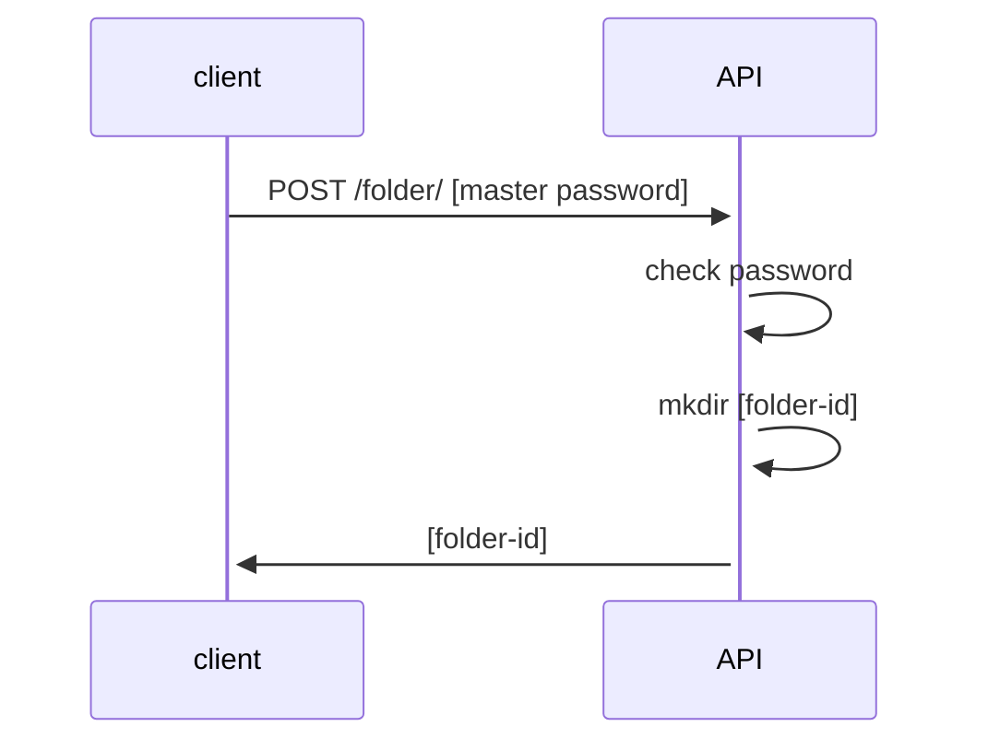
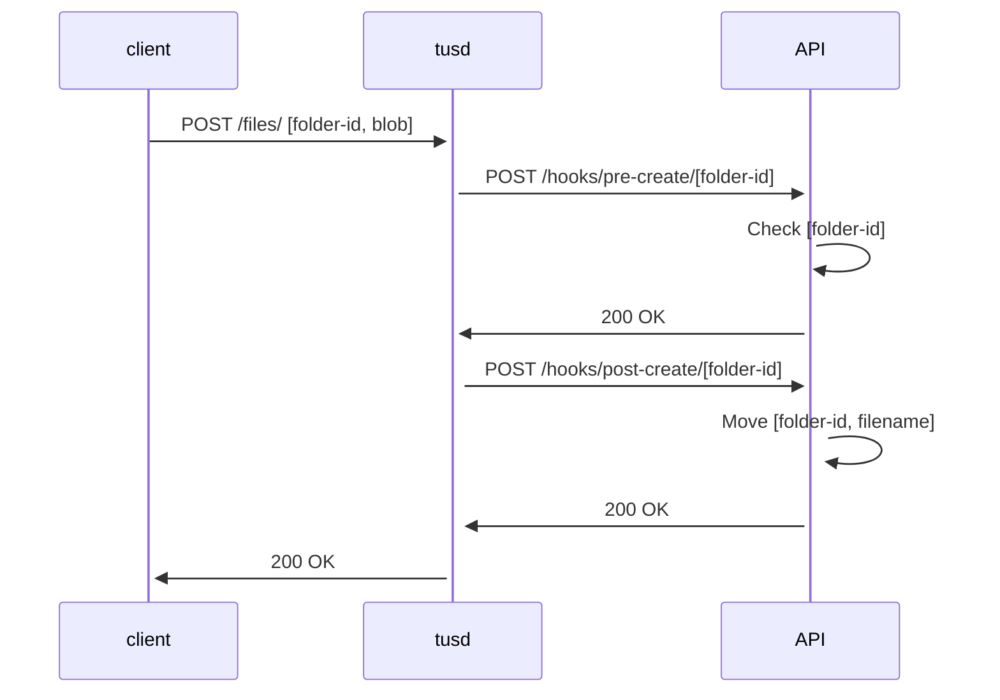
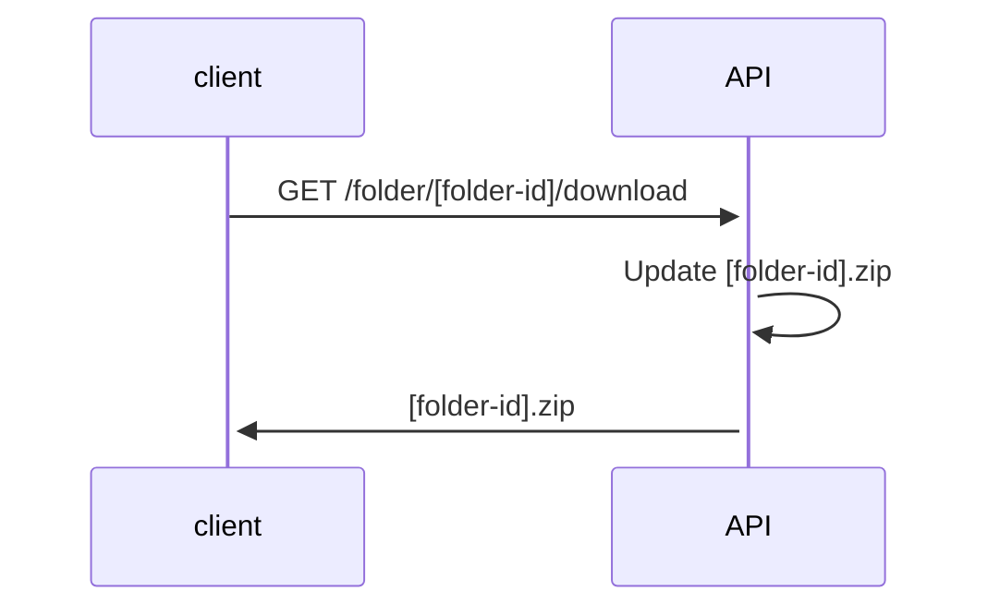

# Besace

Temporary shared folders.

## Usage

Alice, Bob, and Carol spent the week-end together.

1. Alice creates a new *Besace* folder, by visiting the password-protected homepage
2. She is redirected and gets a link (eg. https://mybesace.com/#ossa-teneas-doctum)
2. Alice shares the link with her friends on a group chat
3. The page shows an extremely simple interface: to *Upload* and *Download* files
4. Alice starts uploading her files
5. Bob and Carol do the same, and tell when they're done on the group chat
6. Anyone can download the content of the folder during 7 days, before it gets deleted forever


## Goals and Features

- No authentication
- Avoid sharing pictures and videos on chat applications
- Keep original quality and definition
- Minimalist tech
- Resumable file uploads
- Self-hostable
- Detect duplicate files
- Protect creation of new folders with a master password (eg. maintain usage trustworthy)
- Thumbnails and single file download


## Ideas for the Future

(Eventually) *Besace* could:

- Have a proper UI implemented professionally
- Have a configurable maximum size per folder
- Have state (eg. get only content that changed since last download, exclude your own files, etc.)
- Send notifications (eg. when new content is uploaded, folder about to expire, ...)
- Have paid options (eg. password protected, extended expiration)
- Come with mobile apps

(*But I'll probably focus on another side-project by then...*)


## Existing Alternatives

### WhatsApp, Telegram

- Loss of quality (1600 pixels) when not using *HD* option
- No bulk download of files
- Files hosted in GAFAM cloud

### GDrive, GPhotos, Dropbox, iCloud

- Requires account
- Content does not expire

### Synology Photos

- Restricted to owner of Synology

### Smash, WeTransfer

- Only one user can upload

### Eventer

- Only photos and videos
- Overkill for a weekend between friends

### Chevereto

- Image oriented
- No notion of folder


## Besace's Architecture

* Static Web page
* No database, file storage is source of truth
* Folder names are just random words that can't be guessed easily
* https://tus.io/ for resumable file uploads

### Creation of folders

1. User visits homepage
2. Creation form prompts for master password
3. For the folder id, the server picks 3 random words from a Latin dictionnary (~200 billions possibilities)
4. Once created, the folder is shown (Use page URL to copy & paste in group chat)


The API is just in charge of checking the master password and creating the folder:



### Upload of files

1. User visits upload/download https://mybesace.com/#ossa-teneas-doctum
2. User picks her file(s)
3. Web page shows progress bar(s)

Under the hood, the JavaScript client uploads files to *tusd*, passing the folder id as [upload metadata](https://tus.io/protocols/resumable-upload#upload-metadata) (`Upload-Metadata=folderId foo`).

> Note: *tusd* is proxied and not accessed directly by clients

We use [tusd hooks](https://github.com/tus/tusd/blob/main/docs/hooks.md) to:

- check that target folder exists before uploading
- check that md5 sum of new file is not already in folder
- move file to target folder when done uploading



### Download of files

1. User visits folder page https://mybesace.com/#ossa-teneas-doctum
2. User clicks download button and obtains a Zip archive with all files



### Scheduled jobs

* **Delete old folders**: Every folder whose oldest file is older than `BESACE_RETENTION_DAYS` days gets deleted.

> Note: for the sake of simplicity, we don't have *scheduled* jobs (for now), the expired folders are deleted everytime a new folder is created.


## Development

Keep it fun.


Frontend:

- disable browser cache in Dev Tools


## Run locally

```
docker compose up
```

Visit http://localhost:8080


## Host yours!

I only share the passwords of my *Besace* instance with my family and friends, but you can run yours :)

As an example on my server, *Besace* is deployed with:

* A `local.env` file with the creation password values `BESACE_CREATE_SECRETS=s2cr2t,s3cr3t`
* Docker Compose that runs the *tusd* and Web API containers with `docker compose --env-file ./local.env up -d tusd api`
* Apache as a reverse proxy (see [example conf](config/apache2.conf))
* Apache as SSL termination with a [Let's Encrypt](https://letsencrypt.org) certificate

> Note: Apache because that's what my server has been running for 20 years.

> Note: You may want to be extra-careful when sharing links to the world. The Internetz can be extremely wild when it comes to free hosting of files. According to the laws of your jurisdiction, **you may bear legal responsibility for the content you share**. At least make sure that your secrets are long and difficult to guess, and change them regularly.


## Credits

- Icons from [svgrepo.com](https://www.svgrepo.com)

## License

- MIT license
