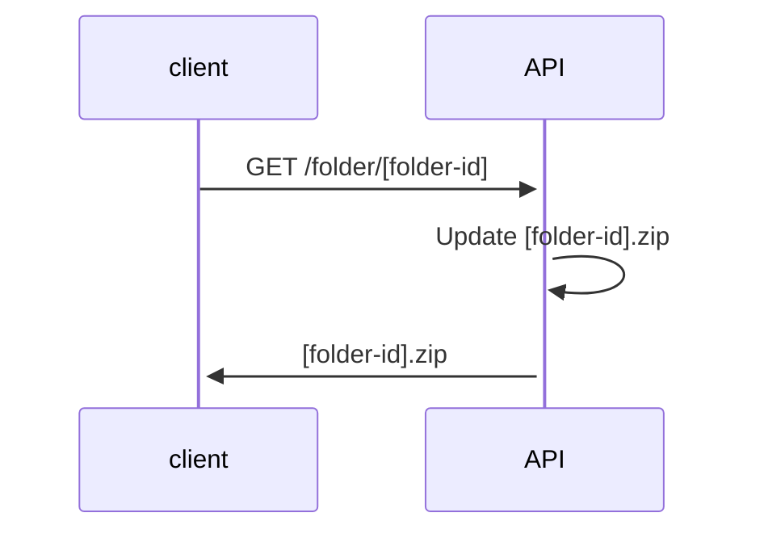

# Besace

Temporary shared folders.

## Usage

Alice, Bob, and Carol spent the week-end together.

1. Alice creates a new *Besace* folder, and gets a link https://mybesace.com/ABF9DA1B-F65F-4AC4-A87E-6E3C2BD36AC3/
2. Alice shares the link with her friends on a group chat
3. The page shows an extremely simple interface: two big buttons, *Upload* and *Download*
4. Alice starts uploading her files
5. Bob and Carol do the same, and tell when they're done on the group chat
6. Anyone can download the content of the folder during 7 days, before it gets deleted forever

## Goals

- No authentication
- Avoid sharing pictures and videos on chat applications
- Keep original quality and definition
- Detect duplicates
- Minimalist tech
- Resumable file uploads
- Self-hostable

## Ideas for the Future

(Eventually) *Besace* could:

- Protect creation of new folders with a master password (eg. maintain usage trustworthy)
- Have state (eg. get only content that changed since last download)
- Send notifications (eg. when new content is uploaded, folder about to expire, ...)
- Have paid options (eg. password protected, extended expiration)
- Come with mobile apps

## Existing Alternatives

### GDrive, GPhotos, Dropbox, iCloud

- Requires account
- Content does not expire

### Synology Photos

- Restricted to owner of Synology

### Smash, WeTransfer

- Only one user can upload

## Architecture

* Static Web pages
* No database, file storage is source of truth
* Folder names are just UUIDs that can't be guessed
* https://tus.io/ Resumable file uploads

### Creation of folders

1. User visits homepage
2. Creation form prompts for master password
3. Once created, a snippet with folder URL is shown (copy & paste in group chat)

```
Drop your files in my Besace at http://mybesace.com/ABF9DA1B-F65F-4AC4-A87E-6E3C2BD36AC3/
```

The API is just in charge of checking the master password and creating the folder:


### Upload of files

1. User visits upload/download http://mybesace.com/ABF9DA1B-F65F-4AC4-A87E-6E3C2BD36AC3/
2. User picks her file(s)
3. Web page shows progress bar(s)

Under the hood, the JavaScript client uploads files to *tusd*, passing the folder id as custom header (eg. `X-Besace-Folder-Id={uuid}`).

> Note: *tusd* would be proxied and not accessed directly by clients

We could use [tusd hooks](https://github.com/tus/tusd/blob/main/docs/hooks.md) to:

- check that target folder exists before uploading
- move file to target folder when done uploading


### Download of files

1. User visits upload/download http://mybesace.com/ABF9DA1B-F65F-4AC4-A87E-6E3C2BD36AC3/
2. User clicks download button and obtains a Zip archive with all files



### Scheduled jobs

* **Delete old folders**: Every folder whose oldest file is older than X days gets deleted. 

## License

- MIT license
